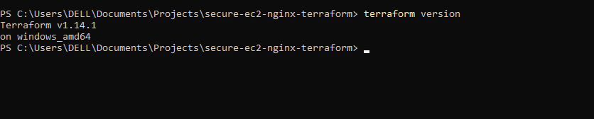
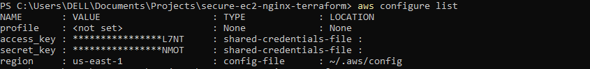
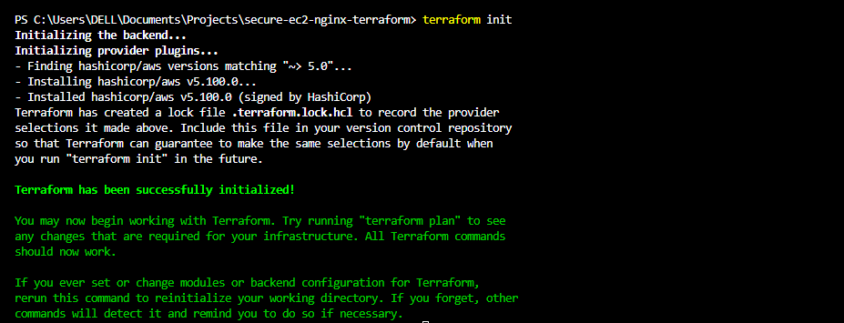
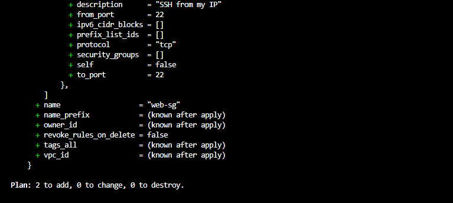
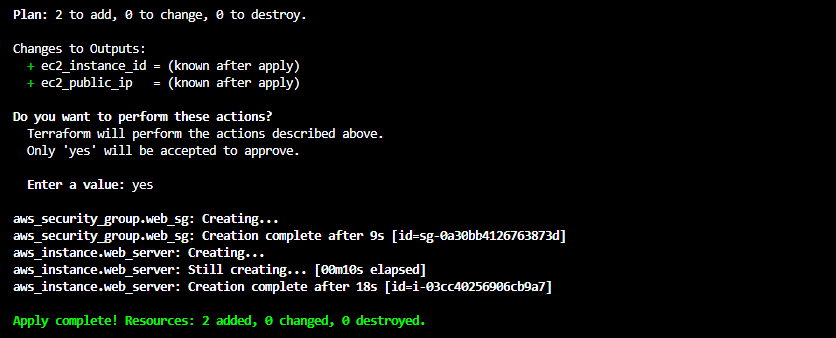
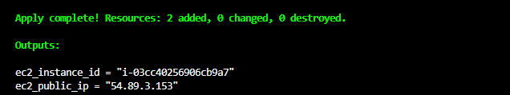
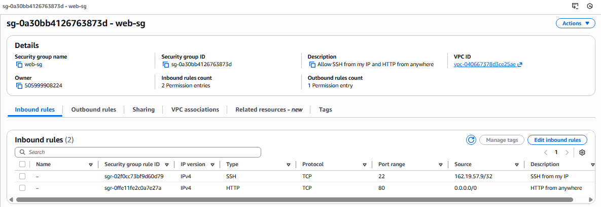
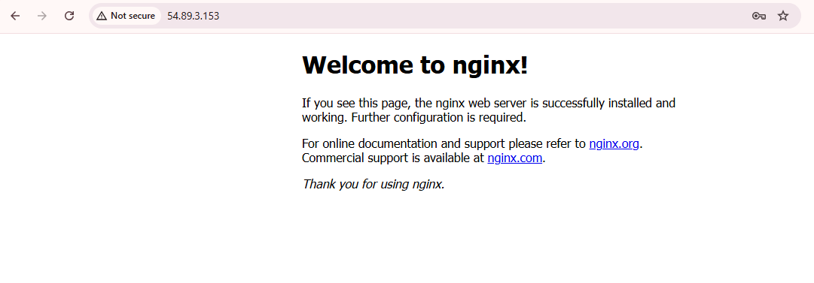
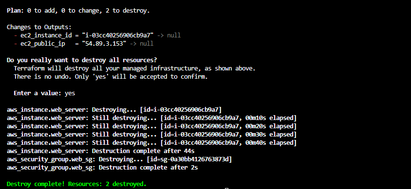

# Secure EC2 NGINX Deployment with Terraform

This project demonstrates how to deploy, secure, verify, and tear down an AWS EC2 instance running NGINX using Terraform, with a focus on security and cost control.

---

## Project Overview

This project provisions a simple web server on AWS using Terraform.
NGINX is installed on an EC2 instance, access is controlled using Security Groups, and all resources are destroyed after testing to avoid ongoing charges.

---

## Architecture

User → Internet → AWS Security Group → EC2 Instance → NGINX Web Server

---

## Tools and Environment

* Windows laptop (local development)
* Terraform
* AWS CLI
* AWS EC2
* Amazon Linux 2023
* NGINX

---

### Screenshot: Terraform installed locally

---

### Screenshot: AWS CLI configured

---

## Terraform Workflow

### Terraform Initialization

Terraform initializes the working directory and downloads required providers.

---

### Terraform Validation

Terraform validates the configuration files before deployment.

---

### Terraform Plan

Terraform generates an execution plan showing the resources to be created.

---

### Terraform Apply

Terraform provisions the infrastructure successfully.

---

### Terraform Outputs

Terraform displays output values such as the EC2 public IP and instance ID.

---

## AWS Resources Verification

### EC2 Instance Running

The EC2 instance is confirmed running in the AWS Console.

---

### Security Group Configuration

Inbound rules show SSH restricted to a single IP using `/32` and HTTP open to the public.

---

## Web Server Verification

NGINX is accessed successfully using the EC2 public IP address.

---

## Security Considerations

* SSH restricted to a single trusted IP using `/32`
* HTTP allowed publicly to serve web traffic
* AWS Security Groups used as the primary firewall
* Key-based SSH authentication used
* No OS-level firewall enabled on Amazon Linux 2023

---

## Cost Management

* Free-tier eligible EC2 instance used
* Resources created only for testing
* No idle or unnecessary services left running

---

## Infrastructure Teardown

All resources were destroyed using Terraform after testing.

---

## Final Update: Resource Cleanup and Cost Control

All AWS resources created during this project were successfully destroyed.

* EC2 instances terminated
* Security Groups removed
* No resources left running
* No ongoing charges incurred